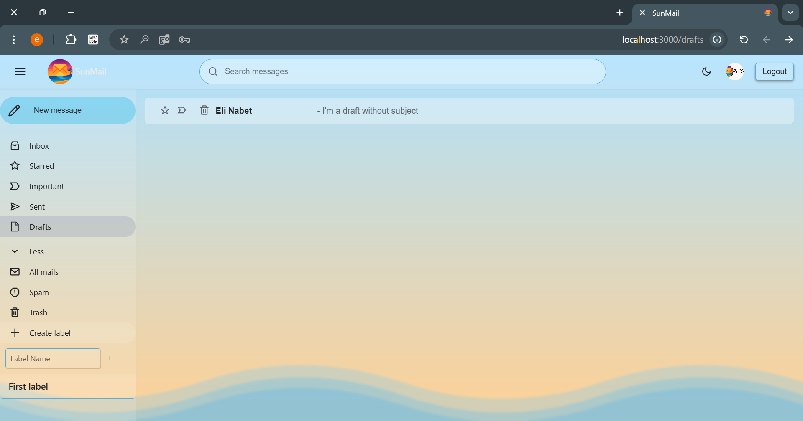

# ex4.Web - SunMail


---

## Description

ex4.Web is a modern web application designed to manage your emails. It offers an intuitive interface and advanced features such as label organization, draft management, a security filtering system based on a Bloom filter, and a dark mode for a better user experience. Data is currently stored locally in memory arrays, which simplifies development and testing.

---

## Features

### Email Management

- **Send and receive emails** : Allows users to compose and send emails through a dedicated interface. Received emails are displayed in the inbox.
- **Create, edit and delete drafts** : Users can save drafts to edit or send later. Drafts can also be deleted if necessary.
- **Delete emails** : Emails can be moved to trash for temporary deletion or permanently deleted.
- **Mark emails as read/unread** : Users can mark emails as read or unread to better organize their inbox.
- **Advanced search** : A search bar allows finding emails based on keywords present in the subject, content, or associated labels.
- **Associate labels with emails** : Users can organize their emails by assigning custom labels.

### Label Management

- **Default labels** : The application includes predefined labels such as Inbox, Starred, Important, Sent, Drafts, Spam, and Trash for quick organization.
- **Create custom labels** : Users can create their own labels to meet their specific needs.
- **Add and remove labels associated with emails** : Labels can be added or removed directly from the user interface.
- **Intuitive interface** : A dedicated menu allows easy label management and association with emails.

### Security and Filtering

- **Malicious URL filtering via Bloom filter** : The C++ module implements a Bloom filter to detect and block malicious URLs in emails.
- **Automatic blacklist addition** : When a user marks an email as spam, all URLs present in that email are automatically added to the blacklist. This ensures these links can no longer be used in future emails.
- **URL validation in emails before sending** : URLs present in emails are verified before sending to ensure they are not on the blacklist.
- **Automatic movement of emails containing blacklisted URLs** : Emails containing malicious URLs are automatically moved to the Spam folder.

### Dark Mode

- **Enable/disable dark mode** : Users can switch between light and dark mode via a dedicated button in the interface.
- **Adapted styles** : Colors and styles are optimized for better readability in dark mode.
- **Visual effects and animations** : Animations and visual effects, such as smooth transitions, enhance the user experience.

### User Interface

- **Sidebar with navigation** : A sidebar allows easy navigation between different folders (Inbox, Starred, Sent, etc.) and label management.
- **Compose window** : A dedicated interface allows composing emails with advanced options such as adding labels and URL validation.
- **Search bar** : A search bar at the top of the interface allows quickly finding emails based on keywords.
- **Label management via dedicated menu** : Users can create, edit and delete labels directly from the interface.
- **Main pages** :
  - `InboxPage` : Displays received emails with options to sort and mark them.
  - `MailPage` : Displays email details, including content, labels, and URLs.
  - `RegisterPage` : Allows users to register and create an account.
  - `ComposePage` : Interface for writing a new email with advanced options.

---

### Screenshots

#### Login Page


#### Register Page


#### New Mail

  


#### Creating a New Label

  


#### Mail View

  


#### Adding a Label to a Mail

  


#### Inbox Page

  


#### Label Page


#### Starred Mail


#### Draft Management

##### Attempt to send a mail without all the data


##### Draft Page



##### Editing a Draft


##### Sending a Draft


#### Mails Search


#### Delete mail


#### Spam Management

##### Mail Before spam


##### Mail in Spam


##### New Mail with a blacklisted URL is directly sent to Spam


#### Response Management

##### Compose Response


##### Got Response


---

## Project Architecture

### Backend

- **Node.js with Express** : The backend is a RESTful API that manages emails, drafts, labels, and blacklist.
- **Local storage** : Data (emails, labels, drafts) is stored in memory arrays, which simplifies development and testing.
- **Main endpoints** :
  - `/api/mails` : Manages emails (sending, receiving, deletion).
  - `/api/labels` : Manages labels (creation, modification, deletion).
  - `/api/blacklist` : Manages blacklist (addition, deletion, verification).
- **URL validation** : URLs present in emails are extracted and verified against the blacklist before sending.

### Frontend

- **React** : The frontend uses React to provide a modern and responsive user interface.
- **CSS Modules** : Styles are isolated for each component, ensuring easy customization and maintenance.
- **Main components** :
  - `Sidebar` : Allows navigation between folders and label management.
  - `TopBar` : Includes the search bar and dark mode toggle button.
  - `Mail` : Displays email details.
  - `LabelMenu` : Allows label management.
  - `ComposeWindow` : Interface for writing emails.

### C++ Module

- **Bloom Filter** : Implemented in C++ to efficiently manage blacklists.
- **Features** :
  - Add URLs to the filter.
  - Check if a URL is blacklisted.
  - Remove URLs from the filter.
- **Communication** : A TCP server allows the Node.js backend to communicate with the C++ module.

---

## Docker Instructions

### Prerequisites

- Docker and Docker Compose must be installed on your machine.

### Steps to run the application

1. **Clone the project** :

   ```bash
   git clone https://github.com/reut2423/ex4.Web.git
   cd ex4.Web
   ```

2. **Run containers with Docker Compose** :

   ```bash
   docker-compose up --build -d
   ```

3. **Access the application** :
   - Frontend : [http://localhost:3000](http://localhost:3000)
   - Backend : [http://localhost:8080](http://localhost:8080)

---

## How does the application work?

### Workflow

1. **Account creation** : Register via the dedicated page.
2. **Login** : Access your emails after authentication.
3. **Email management** :
   - Compose a new email via the compose window.
   - Add labels to organize your emails.
   - **Advanced search** : Find your emails by keywords in the subject or content.
4. **Filtering** :
   - Malicious URLs are automatically detected and blocked.
   - When an email is marked as spam, all URLs it contains are added to the blacklist.
   - Emails containing blacklisted URLs are moved to the Spam folder.
5. **Dark Mode** :
   - Enable dark mode for an enhanced visual experience.

---

## Technologies Used

### Backend

- Node.js
- Express
- Local storage (memory arrays)

### Frontend

- React
- CSS Modules

### C++ Module

- Bloom Filter for blacklist management

### Containerization

- Docker
- Docker Compose

---

## Developers

- The project was developed by @reut2423, @ElieInbar and @elinab26
